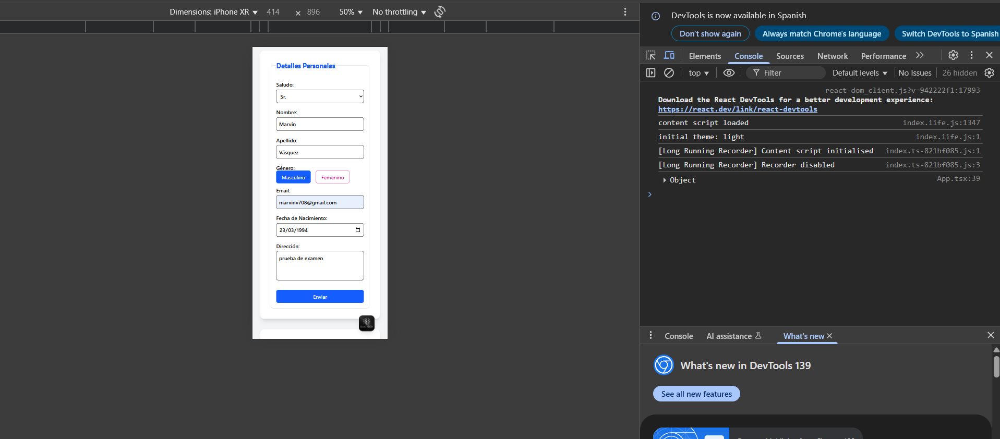
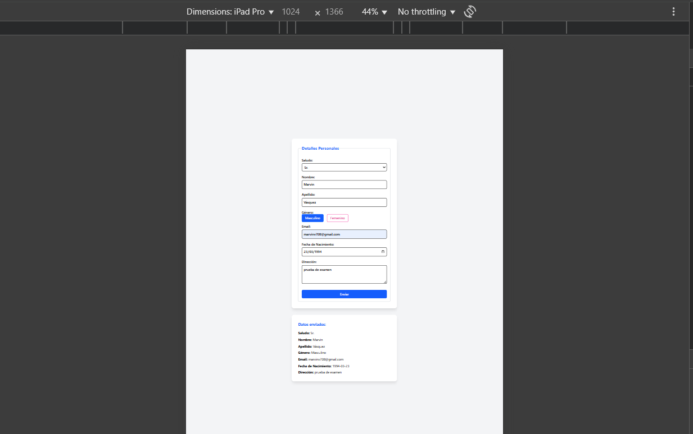
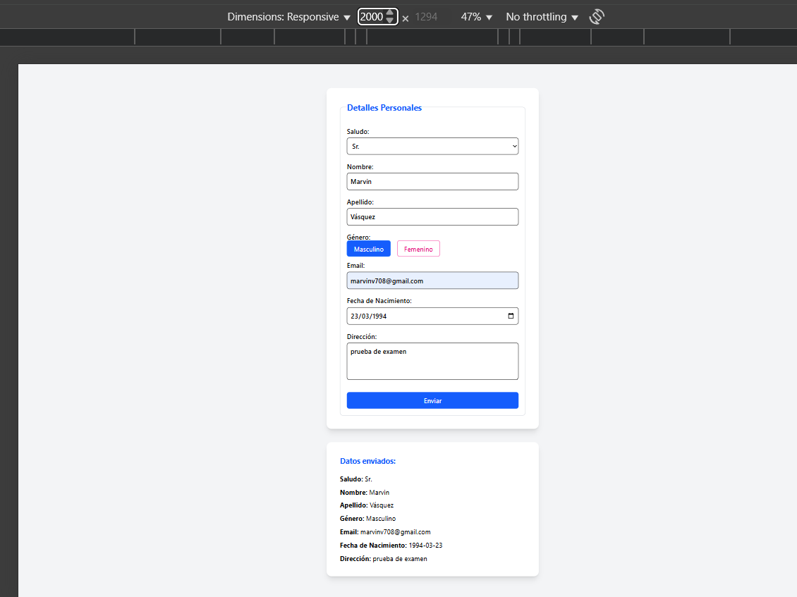

# Formulario Examen

Este proyecto es un formulario web responsivo construido con **React**, **Vite** y **TailwindCSS**.

## Tecnologías utilizadas

- [React](https://react.dev/)
- [Vite](https://vitejs.dev/)
- [TailwindCSS](https://tailwindcss.com/)
- [Vercel](https://vercel.com/) (para despliegue)

## Instalación y ejecución local

1. **Clona el repositorio:**
   ```bash
   git clone https://github.com/Alexmavl/formulario-examen.git
   cd formulario-examen
   ```

2. **Instala las dependencias:**
   ```bash
   npm install
   ```

3. **Ejecuta el proyecto en modo desarrollo:**
   ```bash
   npm run dev
   ```

4. Abre tu navegador en [http://localhost:5173](http://localhost:5173) (o el puerto que indique la terminal).

## Despliegue

El proyecto está publicado en Vercel y puedes verlo en línea aquí:  
👉 [https://formulario-examen.vercel.app/](https://formulario-examen.vercel.app/)

## Notas

- El formulario es completamente responsivo y funciona en computadoras, tabletas y celulares.

Movil



Tablet


Escritorio


